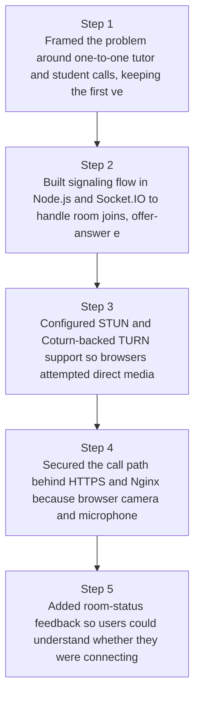
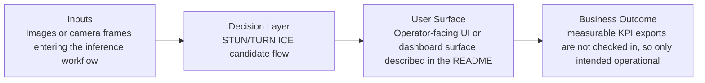
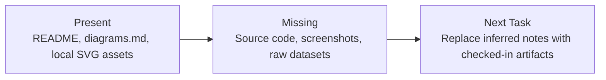

# Reliable Browser Video Calling Diagrams

Generated on 2026-04-26T04:29:37Z from README narrative plus project blueprint requirements.

## WebRTC signaling flow

## STUN/TURN ICE candidate flow

## Evidence Gap Map

